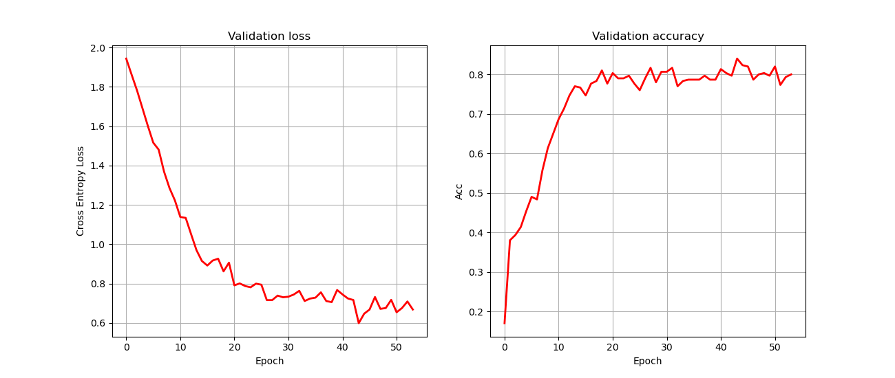

# PyTorch Graph Convolutional Network
PyTorch implementation of the [Graph Convolutional Network](https://arxiv.org/abs/1609.02907) paper by Kipf et al.

### Table of Contents
* [Graph Neural Networks](#graph-neural-networks)
* [Dataset](#dataset)
* [GCN Architecture](#gcn-architecture)
* [Results](#results)
* [Instructions](#setup-and-instructions)
* [Acknowledgements](#acknowledgements)

## Graph Neural Networks 
Graph Neural networks are a family of neural networks that can deal with data which represents a specific class of problems which can be modelled using graphs. Graphs contain nodes/vertices which can (but don't have to) be connected via some edges. An example of this is friendship representation of some social media platform. Since there aren't any hard constraints on how the graph should look like we must use a specific family of neural networks called **Graph Neural Networks** or **GNNs** for short.

## Dataset
The dataset used in this implementation is **Cora**. Cora consists out of **2708 nodes** and **5429 edges**. </br>
* Each node represents a particular science paper and each node is represented by the **1433** features. Each node also has one class assigned to it based on the area of research this paper was devoted to. There are **7 classes in total**.</br>
* Each edge represents the citation between the two connected papers. These edges are directioned in the original form, since paper A cites paper B, so the direction of edge has certain meaning, but the authors in the Kipf et al. transformed all of the edges into the undirectioned form, and so did I.


### Visualization
Below we can see the Cora dataset visualized. The size of each node is directly proportional to the degree of that node. In this case the degree of a node corresponds to the number of edges connected to that node.

<div align="center">

</div>

The visualization was inspired by [Aleksa's GAT implementation](https://github.com/gordicaleksa/pytorch-GAT).

## GCN Architecture
Graph Convolutional Neural Network is a first-order approximation of the spectral graph convolutions.
</br>
Below we can see the illustration of the architecture. This illustration was taken from the official [GCN paper](https://arxiv.org/abs/1609.02907).

<div align="center">

</div>

The *input layer* takes the input features of each node batched together. These features are then forward propagated through **one hidden** layer and the output layer with 7-dim output (since there are 7 classes).

## Results
### Validation peformance

Validation loss and accuracy we see below were obtained by using early stopping. The training was set to maximum of **200 epochs** as specified in the paper. If the validation loss hasn't improved for 10 epochs, the training is stopped. The model which was trained in this run achieved an accuracy of ```82%``` on the test set.


### Learned representation 
The 7-dim embeddings learned by the GCN model were projected into **2D** space by using [t-SNE](https://en.wikipedia.org/wiki/T-distributed_stochastic_neighbor_embedding).
As we can see, the model has learned some useful information about the graph structure and the node features in particular.

<div align="center">

</div>

### Classification results
The training of the GCN model was performed in 100 distinct runs with and without using early stopping. For early stopping a patience of 10 epochs was used. The results are similar most of the time.
By repeating this process several times lowest accuracy achieved was **80%** and the highest was about **82%**. But besides that the results given in the table below were most dominant.

|  Mean Acc.   |  Std. Acc.   |  Mean loss  |  Std. loss |
|:---:|:---:|:---:|:---:|
| 81.0 | 1.0 | 0.65 | 0.02 |


## Setup and Instructions
1. Open Anaconda Prompt and navigate to the directory of this repo by using: ```cd PATH_TO_THIS_REPO ```
2. Execute ``` conda env create -f environment.yml ``` This will set up an environment with all necessary dependencies. 
3. Activate previously created environment by executing: ``` conda activate pytorch-gcn ```
4. Run ``` main.py ``` in your IDE or via command line by executing ``` python src/main.py ```. </br>
All of the arguments specified in the ``` config ``` object from [globals.py](src/globals.py) can be modified in the command line.
   
## Acknowledgements
These repos were very helpful for me:
* [Official PyTorch GCN Implementation by Kipf et al.](https://github.com/tkipf/pygcn)
* [PyTorch Geometric](https://github.com/rusty1s/pytorch_geometric)
* [Aleksa's GAT implementation](https://github.com/gordicaleksa/pytorch-GAT)

## Licence
[](https://opensource.org/licenses/MIT)
